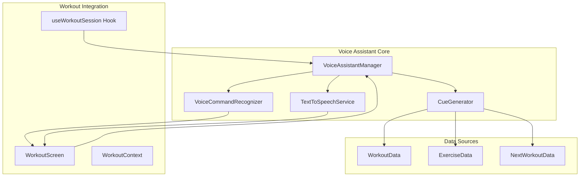
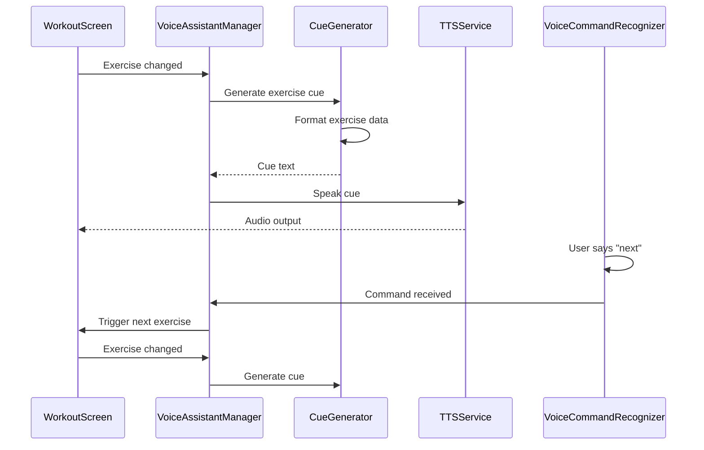

# Voice Assistant for Workout Cues

## Overview

A generic voice assistant system that provides real-time workout cues during exercise sessions and delivers information about upcoming workouts upon completion. The system will integrate seamlessly with the existing workout flow and support both iOS and Android platforms.

## Architecture




## Core Components

### 1. Voice Assistant Manager (`lib/voice-assistant.ts`)

- Central coordinator for all voice assistant functionality
- Manages TTS and speech recognition lifecycle
- Handles state (enabled/disabled, volume, voice settings)
- Provides API for other components to trigger cues

### 2. Text-to-Speech Service (`lib/voice-assistant/tts-service.ts`)

- Wraps platform-specific TTS APIs
- Uses `expo-speech` for cross-platform TTS
- Handles voice selection, rate, pitch, and volume
- Queue management for sequential cues

### 3. Voice Command Recognizer (`lib/voice-assistant/voice-commands.ts`)

- Listens for simple voice commands during workouts
- Commands: "next", "repeat", "pause", "resume", "skip", "what's next"
- Uses `expo-speech` for iOS and Android Speech Recognition APIs
- Processes commands and triggers appropriate actions

### 4. Cue Generator (`lib/voice-assistant/cue-generator.ts`)

- Generates natural language cues from workout data
- Templates for different cue types:
- Exercise start: "Next exercise: [name]. [Sets] sets of [reps] reps at [weight] pounds"
- Set completion: "Set [number] complete. Rest for [time] seconds"
- Rest timer: "Rest period starting. [time] seconds remaining"
- Workout complete: "Workout complete! Great job. Your next workout is [name] on [date]"
- Handles different exercise types (sets/reps, duration-based, circuits)

### 5. Voice Assistant Hook (`hooks/use-voice-assistant.ts`)

- React hook for components to interact with voice assistant
- Provides: `speak()`, `stop()`, `isEnabled`, `toggle()`, `processCommand()`
- Manages voice assistant state and lifecycle

### 6. Voice Assistant Context (`contexts/voice-assistant-context.tsx`)

- Global state for voice assistant preferences
- Settings: enabled/disabled, volume, voice speed, which cues to play
- Persists preferences to AsyncStorage

### 7. Voice Assistant Settings Component (`components/settings/voice-assistant-settings.tsx`)

- UI for configuring voice assistant
- Toggle enable/disable
- Volume slider
- Speech rate adjustment
- Cue preferences (which events trigger cues)

## Integration Points

### Workout Screen Integration (`app/(tabs)/workout.tsx`)

- **Exercise Start**: When `currentExerciseIndex` changes, trigger exercise cue
- **Set Completion**: When set is logged, trigger set completion cue
- **Rest Timer**: During rest periods, provide countdown cues (optional)
- **Exercise Complete**: When exercise is completed, announce next exercise
- **Workout Complete**: When workout finishes, announce completion and next workout info

### Workout Completion Flow

- After `markPlanDayAsComplete()`, fetch next workout from dashboard data
- Generate summary: "Your next workout is [name] on [date]. It includes [exercise count] exercises and will take approximately [duration] minutes."

### Voice Commands Integration

- "Next" → Advance to next exercise (if available)
- "Repeat" → Re-speak current exercise information
- "Pause" → Pause workout timer (if applicable)
- "Resume" → Resume workout timer
- "Skip" → Skip current exercise (with confirmation)
- "What's next?" → Announce next exercise details

## Data Flow




## Implementation Details

### Dependencies

- `expo-speech`: Cross-platform TTS (already available in Expo)
- `expo-av`: For audio playback control (if needed)
- React Native Speech Recognition (for voice commands):
- iOS: Built-in Speech framework
- Android: `@react-native-voice/voice` or similar

### File Structure

```javascript
lib/
  voice-assistant.ts              # Main manager
  voice-assistant/
    tts-service.ts                # TTS wrapper
    voice-commands.ts             # Speech recognition
    cue-generator.ts              # Cue text generation
    types.ts                      # TypeScript types

hooks/
  use-voice-assistant.ts          # React hook

contexts/
  voice-assistant-context.tsx     # Global state

components/
  settings/
    voice-assistant-settings.tsx  # Settings UI
  voice-assistant/
    voice-toggle-button.tsx       # Quick toggle button
```


### Cue Types and Triggers

1. **Workout Start**: When workout begins

- "Starting your workout: [workout name]. [Total exercises] exercises today."

2. **Block Start**: When entering a new block (warmup, main, cooldown)

- "Starting [block type]: [block name]"

3. **Exercise Start**: When exercise changes

- "Next exercise: [name]. [Sets] sets of [reps] reps. [Weight] pounds. Rest [rest time] seconds between sets."

4. **Set Completion**: After logging a set

- "Set [number] complete. [Remaining sets] sets remaining."

5. **Rest Period**: During rest timer

- Optional: "Rest for [time] seconds" (at start)
- Optional: Countdown at 10, 5, 3, 2, 1 seconds

6. **Exercise Complete**: When exercise is finished

- "Exercise complete. Moving to next exercise."

7. **Workout Complete**: When entire workout is done

- "Congratulations! Workout complete. [Total time] minutes. [Calories] calories burned."
- "Your next workout is [name] on [date]. [Description]. [Exercise count] exercises planned."

8. **Circuit Round**: For circuit blocks

- "Round [number] complete. [Remaining rounds] rounds remaining."

## Settings & Preferences

- **Enabled/Disabled**: Master toggle
- **Volume**: 0-100% (default: 80%)
- **Speech Rate**: 0.5x - 2.0x (default: 1.0x)
- **Voice Selection**: Platform default or user selection
- **Cue Preferences**: Toggle individual cue types
- Workout start
- Exercise start
- Set completion
- Rest timer
- Exercise complete
- Workout complete
- Next workout info

## Error Handling

- Handle TTS initialization failures gracefully
- Fallback to silent mode if permissions denied
- Log errors but don't interrupt workout flow
- Show user-friendly error messages in settings

## Permissions

- iOS: Speech recognition permission (Info.plist)
- Android: RECORD_AUDIO permission (AndroidManifest.xml)
- Request permissions on first use with clear explanation

## Testing Considerations

- Test on both iOS and Android devices
- Test with different workout types (traditional, circuit, duration-based)
- Test voice commands in noisy environments
- Test TTS with different languages/accents
- Test interruption handling (phone calls, notifications)

## Future Enhancements (Out of Scope)

- Custom voice training
- Multiple language support