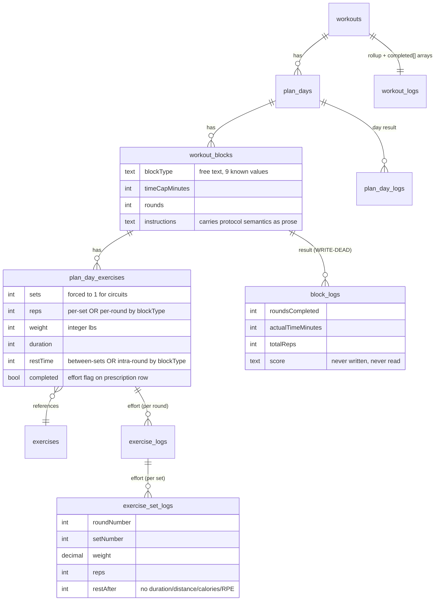
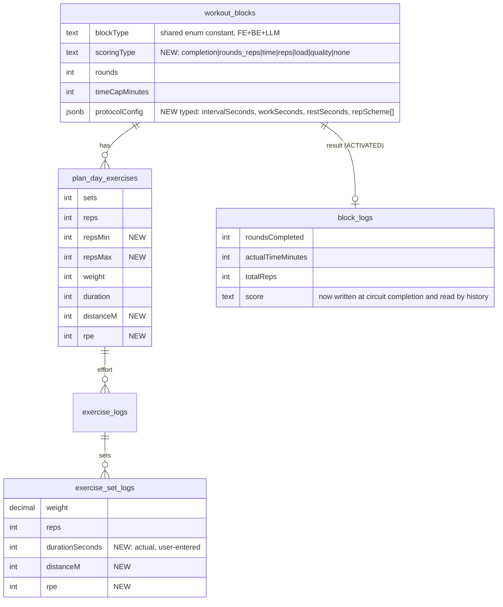

# Workout Logging Architecture — Gap Analysis

**Date:** 2026-07-24
**Status:** Analysis only. No code, schema, or behavior changes were made.
**Scope:** Full stack — `masters-fit-backend` (Drizzle/Postgres, generation, logging, analytics) and `frontend` (Expo/React Native workout experience). Compared against a generalized Plan → Day → Block → {Movements, Effort Logs, Block Result} framework with structure and scoring as separate concepts.

---

## 1. Executive summary

**The surprise finding: MastersFit's data model already anticipates most of the generalized framework — the gap is not the schema, it's the wiring.** The hierarchy `workouts → plan_days → workout_blocks → plan_day_exercises` maps 1:1 onto Plan → Day → Block → Block Movements, and a `block_logs` table (rounds completed, actual time, total reps, free-text score) is precisely the "Block Result" entity the framework calls for. But:

1. **`block_logs` is write-dead.** The create endpoint exists on the controller (`logs.controller.ts:228`) but was never wired into the hand-written router (`logs.routes.ts` wires only `/block/:id/skip`). No code path can insert a row; no analytics code reads one.
2. **Circuit/AMRAP scores are computed on the phone and thrown away.** `calculateCircuitScore` (`utils/circuit-utils.ts:127-164`) produces "5+12"-style AMRAP scores and for-time results, displays them during the session, and never sends them to the API. A user who completes an AMRAP today cannot ever see their score again.
3. **The app already *generates* formats it cannot *score*.** The generation enum includes `amrap`, `emom`, `for_time`, `tabata` (`fanout-prompt-generator.ts:57-66`), and the prompts actively describe 21-15-9 schemes, work/rest ratios, and per-minute EMOM assignments — as free text, because neither the AI schema nor the DB has fields for them.
4. **Analytics is barbell-only.** Every volume/PR/trend/goal calculation reads `reps × weight` from `exercise_set_logs`. Duration, distance (no column exists), calories (no column exists), RPE, and block scores are invisible to history and progress.
5. **Two generation paths, one unvalidated.** Weekly generation uses schema-enforced structured output; *all* regeneration and single-day generation uses free-text `JSON.parse` with zero schema validation (`workout-agent.service.ts:404-408`).

The minimum viable evolution is smaller than a redesign: wire and consume the block-result layer that already exists, persist the score already being computed, validate the serial generation path, then add a typed `protocolConfig` + `scoringType` to blocks and a small set of prescription fields (rep ranges/scheme, RPE, distance). No table replacements are needed.

One product constraint the generalized framework does not know about: **Track 5 deliberately deleted all timers** (T5-3 / MF-003, "not supported"). Interval-driven formats (Tabata, strict EMOM, timed circuits) cannot be *faithfully* logged without revisiting that decision — see §16.

---

## 2. Current architecture

### Prescription side ("what to do")

| Entity | Table | Key fields | File |
|---|---|---|---|
| Workout Plan | `workouts` | `startDate/endDate` (text), `isActive` (unique partial idx: one active/user), `completed`, `sourceType` | `backend/src/models/workout.schema.ts:21-49` |
| Workout Day | `plan_days` | `date` (text), `instructions`, `dayNumber`, `isComplete` | `workout.schema.ts:56-79` |
| Workout Block | `workout_blocks` | `blockType` (free text, default `"traditional"`), `blockName`, `blockDurationMinutes`, `timeCapMinutes`, `rounds` (default 1), `instructions`, `order` | `workout.schema.ts:90-110` |
| Block Movement | `plan_day_exercises` | `exerciseId` FK, `sets`, `reps`, `weight` (**integer** lbs), `duration` (sec), `restTime` (sec), `notes`, `completed`, `isSkipped`, `order` | `workout.schema.ts:124-150` |
| Movement catalog | `exercises` | unique on `lower(name)`, `equipment[]`, `muscleGroups[]`, `tag` | `backend/src/models/exercise.schema.ts:20-53` |

There are **no pgEnums anywhere**; every "enum" (block type, difficulty, mood, source type) is free text constrained only in application code or the LLM JSON schema.

### Effort/result side ("what happened")

| Entity | Table | Key fields | File |
|---|---|---|---|
| Effort container (per exercise per round) | `exercise_logs` | `roundNumber` (unique with `planDayExerciseId`), `durationCompleted`, `timeTaken`, `isComplete`, `isSkipped`, `difficulty`, `rating` | `backend/src/models/logs.schema.ts:23-63` |
| Effort (per set) | `exercise_set_logs` | `roundNumber`, `setNumber`, `weight` (**decimal 6,2**), `reps`, `restAfter` — **nothing else** | `logs.schema.ts:66-92` |
| **Block result** | `block_logs` | `roundsCompleted`, `timeCapMinutes`, `actualTimeMinutes`, `totalReps`, `totalDuration`, `score` (text) | `logs.schema.ts:95-131` — **write-dead** |
| Day result | `plan_day_logs` | `totalTimeSeconds`, `blocksCompleted`, `exercisesCompleted`, `totalVolume` (never computed), HR fields (seed-only), `mood` | `logs.schema.ts:134-163` |
| Plan rollup | `workout_logs` | denormalized `completedExercises[]`/`completedBlocks[]`/`skipped*[]` int arrays, `totalTimeMinutes`, `daysCompleted`, `isComplete` | `logs.schema.ts:166-207` |

### Generation (two paths)

- **Fan-out weekly (primary):** `WorkoutAgentService.generateWeeklyWorkout` binds `WORKOUT_DAY_SCHEMA` via `withStructuredOutput` — output guaranteed parseable and enum-constrained (`backend/src/utils/fanout-prompt-generator.ts:118-284`, `workout-agent.service.ts:522,691`).
- **Serial (weekly fallback + weekly regen + daily regen + standalone single-day):** `buildClaudePrompt`/`buildClaudeDailyPrompt` free-text templates → fence-strip → bare `JSON.parse`. **No schema validation, no coercion** (`workout-agent.service.ts:404-408,929-933`). Standalone single-day generation (`workout.service.ts:2508-2560`) reuses this path via the daily-regeneration job.

Block type vocabulary (both paths agree): `traditional, amrap, emom, for_time, circuit, flow, tabata, warmup, cooldown`.

Post-generation: equipment filter → limitation filter → repetition cap (`post-generation-validation.ts:28-53`), then field-by-field persistence in `workout.service.ts:1079-1205`. Unresolvable exercise names are **silently dropped** (`:1180`).

### Logging & completion flow (mobile → API)

- **Traditional blocks:** pre-materialized sets, tap-to-complete + auto-advance with a 5s undo window (T5-1/T5-2), then `POST /logs/exercise` with `{planDayExerciseId, roundNumber, sets[{setNumber, weight, reps}], durationCompleted, timeTaken, notes}` (`frontend/lib/workouts.ts:371-395`; `logs.service.ts:40-114` — deletes-and-rewrites per (exercise, round), hard-codes `isComplete: true`).
- **Circuit blocks** (`amrap/emom/for_time/circuit/tabata` per `utils/circuit-utils.ts:6-12`): `CircuitTracker` captures per-round reps/weight per exercise; on "Complete Circuit", `logCircuitCompletion` (`frontend/lib/circuits.ts:16-103`) posts one exercise-log per exercise per round to `/logs/exercise/batch` + a mark-complete call. **The score and round times are not in the payload.**
- **Warmup/cooldown:** read-only panel; logged as a single synthetic set `{setNumber:1, weight:0, reps: reps||1}` (`workout-screen.tsx:883-897`) — a completion-only mode faked through the set model.
- **Day completion:** `POST /logs/workout/day/:planDayId/complete` sets `plan_days.isComplete`, upserts `plan_day_logs`, re-syncs `workout_logs` arrays (marking **all** blocks of the day complete regardless of what happened, `logs.service.ts:1057-1083`), and rolls up to `workouts.completed` when every day is complete (`:1136-1165`).
- **Analytics-side completion is independently derived** from log existence (`COUNT(exerciseLogs) > 0`, `workout-analytics.service.ts:160-190`) — a third completion mechanism.

---

## 3. Entity and data-flow diagram (current)

Data flow: `LLM → (schema-validated | raw JSON.parse) → post-generation filters → workout.service persistence → mobile render (circuit-utils discriminator) → exercise/set logs → day-complete cascade → analytics (reads set logs only)`.

---

## 4. Mapping to the generalized framework

| Generalized concept | MastersFit equivalent | Coverage | Evidence | Notes |
|---|---|---|---|---|
| Workout Plan | `workouts` | **Full** | `workout.schema.ts:21` | Dates as text; one-active-per-user enforced by partial index |
| Workout Day | `plan_days` | **Full** | `workout.schema.ts:56` | |
| Workout Block | `workout_blocks` | **Full** (structure) | `workout.schema.ts:90` | `blockType/rounds/timeCapMinutes` exist; no interval fields; type unenforced free text |
| Block Movement | `plan_day_exercises` | **Partial** | `workout.schema.ts:124` | Only sets/reps/weight/duration/rest; no distance, calories, tempo, RPE, rep range, per-set variation, side |
| Effort Log | `exercise_logs` + `exercise_set_logs` | **Partial** | `logs.schema.ts:23,66` | Rounds + sets modeled well; set effort is weight+reps only; actual duration is echoed from prescription, never user-entered (`adaptive-set-tracker.tsx:579`) |
| **Block Result** | `block_logs` | **None (in practice)** | `logs.schema.ts:95`; route absent from `logs.routes.ts` | Schema is nearly ideal; unreachable and unread |
| Logging mode | Implicit via `blockType` | **Partial** | `utils/circuit-utils.ts:33-56` | 3 modes exist: set-by-set, round-by-round (batched), warmup/cooldown pseudo-completion-only. No score-only, no interval-by-interval, no true completion-only |
| Scoring type | — | **None** | `block_logs.score` (dead) | Scoring is conflated with block type in UI (`calculateCircuitScore` switches on type) and never persisted |
| Prescription vs effort separation | Split tables, but leaky | **Partial** | `plan_day_exercises.completed` (`workout.schema.ts:138`) | Effort flags live on prescription rows; completion triple-stored (row booleans, `*_logs.isComplete`, `workout_logs` arrays) |

---

## 5. Workout-format support matrix

Dimensions: **G**enerate / **P**ersist / **D**isplay / **L**og / **H**istory-analytics. ✅ Full · ◐ Partial · ✗ None.

### Traditional strength

| Format | G | P | D | L | H | Limiting factor |
|---|---|---|---|---|---|---|
| Straight sets | ✅ | ✅ | ✅ | ✅ | ◐ | The healthy path. History = per-set lines; volume mixes units (§11) |
| Supersets | ✗ | ◐ | ◐ | ◐ | ◐ | Not in generation enum; `superset` has a display label (`workout.types.ts:318`) + analytics label but renders as plain traditional with no pairing semantics |
| Tri-sets / giant sets | ✗ | ✗ | ✗ | ◐ | ✗ | No grouping construct below block |
| Drop sets | ✗ | ✗ | ✗ | ◐ | ◐ | Prescription has one scalar weight/reps per exercise; UI *can* log varied per-set values, but nothing prescribes or labels them |
| Rest-pause | ✗ | ✗ | ✗ | ✗ | ✗ | Free text only |
| Pyramid / reverse pyramid | ✗ | ✗ | ✗ | ◐ | ◐ | Prompt mentions pyramids (`prompt-generator.ts:99`); no per-set rep array; orphan analytics label |
| Cluster sets | ✗ | ✗ | ✗ | ✗ | ✗ | No intra-set rest structure |
| Tempo work | ◐ | ✗ | ◐ | ✗ | ✗ | Prompted into `notes` prose; no field |
| Paused reps | ◐ | ✗ | ◐ | ✗ | ✗ | Notes only |

### Circuits

| Format | G | P | D | L | H | Limiting factor |
|---|---|---|---|---|---|---|
| Fixed-round circuit | ✅ | ✅ | ✅ | ◐ | ◐ | Per-round reps/weight captured; round time inert (timers deleted); history flattens to "first set × N rounds" (`workout-summary.tsx:387-395`) |
| Timed circuit | ◐ | ◐ | ◐ | ✗ | ✗ | `timeCapMinutes` exists; elapsed time never captured (timer scaffolding inert, `use-circuit-session.ts:640-647`) |
| Station circuit | ◐ | ◐ | ◐ | ◐ | ◐ | Same as fixed-round; work/rest per station not modeled |
| Strength / conditioning / mixed-modal circuit | ✅ | ✅ | ✅ | ◐ | ◐ | Same as fixed-round |
| Completion-only circuit | ✗ | ✗ | ✗ | ◐ | ✗ | No completion-only logging mode; would fabricate rep data |

### Functional fitness

| Format | G | P | D | L | H | Limiting factor |
|---|---|---|---|---|---|---|
| AMRAP | ✅ | ◐ | ✅ | ◐ | ✗ | Rounds+reps captured as logs; **score computed and discarded**; nothing readable in history |
| EMOM | ◐ | ◐ | ◐ | ◐ | ✗ | Per-minute assignments are prose; rounds=minutes convention; no timer so "on the minute" is honor-system |
| E90 / E2MOM / E3MOM | ✗ | ✗ | ✗ | ✗ | ✗ | No interval-length field; EMOM hard-assumes 60s (`use-circuit-session.ts:52-59`) |
| Rounds for time | ◐ | ◐ | ◐ | ◐ | ✗ | `for_time` type exists; finish time never captured (`actualTimeMinutes` dead + timers deleted) |
| Chipper | ◐ | ◐ | ◐ | ◐ | ✗ | Representable as `for_time` with rounds=1; prompt names it; no time/score capture |
| Tabata | ◐ | ◐ | ◐ | ◐ | ✗ | Type exists, 8 rounds hard-coded; 20/10 exists only as prompt prose; no timer by product decision |
| Death By | ✗ | ✗ | ✗ | ✗ | ✗ | Needs escalating per-interval reps |
| 21-15-9 / rep schemes | ✗ | ✗ | ✗ | ◐ | ✗ | `reps` is a scalar; prompt *asks* for 21-15-9 (`prompt-generator.ts:74`) with nowhere to put it |
| Buy-in / cash-out | ✗ | ✗ | ✗ | ✗ | ✗ | No sub-block structure |
| Partner workouts | ✗ | ✗ | ✗ | ✗ | ✗ | Single-user model throughout |

### Conditioning & endurance

| Format | G | P | D | L | H | Limiting factor |
|---|---|---|---|---|---|---|
| Work/rest intervals | ◐ | ◐ | ◐ | ✗ | ✗ | Approximated via per-exercise `duration`+`restTime`; no block-level work:rest; prompt describes "30s on/15s off" as prose |
| Sprint / VO2 intervals | ◐ | ◐ | ◐ | ✗ | ✗ | Same + no pace/distance |
| Zone 2 / continuous duration | ◐ | ◐ | ◐ | ◐ | ✗ | Single duration exercise works; **actual duration is echoed from prescription, not entered** (`workout-screen.tsx:811`); invisible to analytics |
| Distance targets | ✗ | ✗ | ✗ | ✗ | ✗ | **No distance column anywhere** (prescription, logs, or analytics) |
| Calorie targets | ✗ | ✗ | ✗ | ✗ | ✗ | No calories column anywhere |
| Pace-based targets | ✗ | ✗ | ✗ | ✗ | ✗ | Derived from distance+time; neither exists |
| Mixed cardio modalities | ◐ | ◐ | ◐ | ◐ | ✗ | Via circuit blocks; same limits |

### Other

| Format | G | P | D | L | H | Limiting factor |
|---|---|---|---|---|---|---|
| Ladders (asc/desc/up-down) | ✗ | ✗ | ✗ | ◐ | ✗ | Orphan analytics label only (`workout-analytics.service.ts:80-98`); needs rep scheme array |
| Complexes | ✗ | ◐ | ◐ | ◐ | ✗ | Could fake as circuit; no "unbroken/same bar" semantics |
| Loaded carries | ✗ | ◐ | ◐ | ✗ | ✗ | Needs distance |
| Mobility flows | ◐ | ✅ | ◐ | ◐ | ✗ | `flow` type generates/persists but renders as plain set-by-set with weight steppers — no completion-only mode |
| Warm-ups / cooldowns | ✅ | ✅ | ✅ | ◐ | ◐ | Dedicated types + simplified UI; logged via synthetic fake set; correctly excluded from type analytics, **not** excluded from volume/PR calcs |
| Recovery sessions | ◐ | ◐ | ◐ | ◐ | ◐ | Rest-day standalone generation exists (`workout.controller.ts:868`); same logging limits |

---

## 6. Key architectural limitations (coupling & special cases)

1. **Block Result layer is dead end-to-end.** `block_logs` create route missing (`logs.routes.ts`); never seeded (`seed-demo-user.ts` imports every log table except `blockLogs`); never read by analytics/dashboard/history (grep: only `ownership.service.ts` for authz). *Fix now — it's the keystone.*
2. **Score conflated with structure in the client, then dropped.** `calculateCircuitScore` switches on blockType to compute a score, `CreateCircuitLogParams.score` exists as a type (`circuit.types.ts:127-148`) but `logCircuitCompletion` never uses it. *Fix now.*
3. **Prescription fields silently change meaning by block type.** `sets` forced to 1 for circuits/AMRAP; `reps` means per-set (traditional) vs per-round (circuit); `restTime` means between-sets vs intra-round (`fanout-prompt-generator.ts:128-141`, `workout-generation.utils.ts:150-153`). Consumers must know blockType to interpret rows. *Tolerable temporarily; document, then absorb into typed config.*
4. **Protocol semantics live in prose.** 21-15-9, EMOM odd/even minutes, work:rest ratios, RPE, %1RM, tempo are all instructed into `instructions`/`notes` strings (`prompt-generator.ts:68-107,537`) — unparseable, unrenderable, unanalyzable. *P1.*
5. **Unvalidated serial generation path.** All regen + standalone single-day flows are bare `JSON.parse` with hand-maintained prompt templates that must be kept in sync with the fan-out schema by hand (three duplicated JSON templates in `prompt-generator.ts:583,953,1286`). *Fix now (cheap zod validation).*
6. **blockType is free text with 3+ drift-prone frontend lists.** `circuit-utils.ts:6-23`, `getBlockTypeDisplayName` (`workout.types.ts:318-338`, includes `superset` which nothing generates), and an inline literal list in `workout-screen.tsx:257-263`. Unknown types silently default to traditional set-by-set. *Fix now (shared constant).*
7. **Completion is triple-stored and can drift**: row booleans (`plan_day_exercises.completed`, `plan_days.isComplete`) + `*_logs.isComplete` + `workout_logs` int arrays; day-complete force-marks **all** blocks complete (`logs.service.ts:1067-1083`); analytics independently infers completion from log existence. *Tolerable; converge during Phase 1 test-writing.*
8. **Analytics assumes barbells.** `SUM(reps*weight) WHERE weight > 0` everywhere (`metrics-calculation.service.ts:24-102,261-367`; `goal-progress.service.ts:132-206`; PRs in `search.service.ts:293-332`). `totalVolume` adds raw rep counts to lb-volume in one integer (`:279-286`). Duration-only efforts contribute zero; endurance goals scored on rep counts. *P1.*
9. **Actual duration is fiction.** The user never enters elapsed/actual duration; `durationCompleted` echoes the prescribed value (`adaptive-set-tracker.tsx:579`; `workout-screen.tsx:811,893`). History shows prescription as if it were performance. *Correctness issue — fix with score/effort entry, or stop displaying it as actuals.*
10. **Dead timer scaffolding.** `CircuitTimerState`, `toggleTimer`, `getCircuitTimerConfig`, `roundTimeSeconds` all type-check but are inert since T5-3 deleted timers; `timer.currentTime` is always 0, so time-cap auto-complete can never fire. *Delete or revive deliberately.*
11. **Flat exercise array assumption.** The session flattens `blocks.flatMap(b => b.exercises)` with one linear index and assumes circuit exercises are contiguous (`workout-screen.tsx:289-292,981-982`); no sort by `order` on either level. *Watch during any block-model work.*
12. **Type/DB disagreements.** Backend `ExerciseLog` interface omits `roundNumber`; `PlanDay` interface omits `isComplete`; `Workout` omits `sourceType` (`workout.schema.ts:186-242` vs table defs). Prescription `weight` is `integer`, logged weight `decimal(6,2)`. Frontend `Exercise.equipment` is a comma-split string vs backend `text[]`.

---

## 7. Data-model gaps

Missing (no column anywhere): **distance, calories, tempo, RPE (numeric), rep ranges (min/max), per-set prescription variation, per-round rep schemes, interval length (work/rest seconds), unilateral side, pace.**

Present but broken: `block_logs.*` (dead), `plan_day_logs.totalVolume` / `workout_logs.totalVolume` / `workout_logs.averageRating` / `completedDays` (never populated), HR + mood (seed-only).

Weak constraints: no enum on `blockType`; no unique on `(planDayId, block.order)` or `(blockId, exercise.order)`; multiple `plan_day_logs` rows per day possible (manually deduped at `logs.service.ts:1039`).

## 8. Backend gaps

- Router/controller drift: block-log CRUD, plan-day-log create/update, progress endpoints defined on `LogsController` but absent from `logs.routes.ts` (a known consequence of the hand-written-router architecture — see the auth remediation history).
- `createExerciseLog` hard-codes `isComplete: true` (`logs.service.ts:77`) — no partial/in-progress state (except the end-early path which passes `isComplete: false` client-side).
- Delete-and-rewrite per (exercise, round) on every log create (`logs.service.ts:59-102`) — fine today, hostile to append-style interval logging.
- No PUT for editing a submitted log (Track 5's T5-6 already flagged this).

## 9. AI schema & prompt gaps

- `EXERCISE_SCHEMA` requires all of `sets/reps/weight/duration/restTime` as scalars — forcing degenerate values (`sets: 1`, `reps: 0`) whose interpretation depends on blockType.
- No `rpe`, `tempo`, `distance`, `repScheme[]`, `workSeconds/restSeconds`, `intervalSeconds` — the prompts compensate by instructing prose (§6.4).
- `limitationConcerns` exists only on the fan-out schema, not the serial templates.
- Prompt/style guide advertises formats the schema can't hold (21-15-9, pyramids, work:rest ratios) — the model is *asked* to generate structure that is immediately flattened.
- Serial path: no validation at all between `JSON.parse` and persistence.

## 10. Mobile UI & state-management gaps

- Renderer selection is a hard-coded 3-way switch (circuit / warmup-cooldown / traditional) keyed off blockType membership lists, not data-driven config. `superset`/`flow` fall through to bare set-by-set.
- No score-entry UI, no completion-only control (warmups fake a set), no actual-duration entry, weight stepper always shown even for bodyweight (`exercise-helpers.ts:52-55`).
- Session state is in-memory only; app kill loses uncommitted progress (resume reconstructs from server logs).
- Circuit history collapsed to one line (first exercise, first set × round count); per-round variation logged but never rendered.
- `difficulty`/`rating` in every payload type, never collected by any UI.

## 11. Logging & history gaps

- AMRAP/for-time/EMOM results: unrecoverable after session end (never persisted).
- Round/interval times: never captured (timers deleted).
- Volume: mixed units (lbs-volume + raw reps in one integer); duration work = 0.
- PRs: max weight/reps only — no time, distance, rounds, or score PRs (`search.service.ts:293-332`).
- Warmup/cooldown synthetic sets pollute volume/PR inputs (excluded only from type-distribution charts).
- Day-complete marks all blocks complete — block-level adherence is unknowable retroactively.

## 12. Test-coverage gaps

Existing tests cover prompt building, post-generation filtering, progression nudging, streak math, and AI-operation quotas — **all pure utils**. There are **zero tests** on: AI output schema validation, exercise/set log endpoints, circuit logging, completion cascade (`markWorkoutDayComplete`), block logs, or any analytics service. Fixtures/seeds exercise only `traditional` + `circuit` blocks and never write `block_logs`. Any migration work must start by characterizing current behavior with tests (Phase 1).

---

## 13. Minimum viable target architecture

Additive only. No table replacements.

1. **Activate the Block Result layer (mostly wiring, zero schema).** Route `POST/PUT /logs/block`; call it from circuit completion with the already-computed `score`, `roundsCompleted`, `totalReps`; render it in `workout-summary`. This alone makes AMRAP/circuit/for-time results real.
2. **Add `scoringType` to `workout_blocks`** (`completion | rounds_reps | time | reps | load | quality | none`), defaulted from blockType at generation but overridable — the structure/scoring separation the framework calls for, as one nullable text column.
3. **Add a typed `protocolConfig` jsonb on `workout_blocks`** (validated by zod, mirrored in the AI schema): `{ intervalSeconds?, workSeconds?, restSeconds?, repScheme?: number[], perMinute?: {...}[] }`. This is the escape hatch for EMOM variants, Tabata-as-data, 21-15-9, ladders — without new tables. Essential behavior (rendering mode, scoring) keys off `blockType` + `scoringType`, not the jsonb.
4. **Widen effort capture minimally:** add `durationSeconds`, `distanceM?`, `rpe?` to `exercise_set_logs` (or accept duration on the set row); make actual duration user-entered where it matters; stop echoing prescription as performance.
5. **Widen prescription minimally:** `repsMin/repsMax` (rep ranges — high value for a 40+ strength audience), `rpe`, `distanceM` on `plan_day_exercises`. Tempo can stay in notes initially.
6. **Unify generation validation:** zod-validate the serial path against the same shape as `WORKOUT_DAY_SCHEMA`; single shared block-type constant exported to the frontend.
7. **Logging modes as renderer strategies:** derive `set_by_set | round_by_round | score_only | completion_only` from `blockType`+`scoringType` in one place (`getLoggingInterface` already exists at `circuit-utils.ts:63` — actually use it); add true completion-only (warmups, mobility) and score-only (for-time) surfaces.
8. **Analytics: segregate by unit.** Volume in lbs where weight exists; rep-volume, duration-minutes, and (later) distance as separate series; read `block_logs` for rounds/score history and score-PRs.

### Proposed minimally evolved model

## 14. Recommended phased migration plan

| Phase | Contents | Schema change | Complexity |
|---|---|---|---|
| **1. Activate & harden** | Wire block-log routes; persist circuit score from `logCircuitCompletion`; show block results in `workout-summary`; zod-validate serial generation; single shared blockType constant; delete dead timer scaffolding; characterization tests on logging + completion | None | **Low** |
| **2. Scoring layer** | `scoringType` column + generation default; score-entry UI for `for_time` (manual time entry — no timer needed); block-result history + score PRs; fix `durationCompleted` echo | 1 column | **Low–Medium** |
| **3. Logging modes** | Data-driven renderer selection; true completion-only (warmup/cooldown/flow — kill synthetic sets); score-only mode; actual-duration entry; set-log `durationSeconds/rpe` | 2–3 columns | **Medium** |
| **4. Protocol config + AI schema** | `protocolConfig` jsonb; extend `WORKOUT_DAY_SCHEMA` (repScheme, intervals, rpe, rep ranges); migrate serial prompts onto the structured schema; reject contradictory combos at normalization | 1 jsonb + prescription columns | **Medium–High** |
| **5. Advanced formats** | Supersets (block sub-grouping or `pairGroup` on exercises), ladders/21-15-9 rendering from `repScheme`, drop sets (per-set prescription array), distance/cardio via Apple Health / Health Connect import into `distanceM`, chipper/buy-in–cash-out structure with partitioning — **acceptance test: represent, perform, and log Murph** | Format-dependent | **High** |

Phases 1–2 are shippable before launch without touching the workout screen's core flow; they mostly *catch data already being produced*.

## 15. Risks & backward compatibility

- **Push-based schema sync** (no migrations): additive columns are safe, but remember the prod-drift incident — preview non-force, then `--force`, both DBs.
- **Existing rows carry overloaded semantics** (`sets=1` circuits, `reps`-as-per-round). New `scoringType`/`protocolConfig` must be nullable with blockType-derived fallbacks so old plans keep rendering.
- **Analytics changes will move dashboard numbers** (excluding warmup sets from volume, splitting units). Communicate or version the metrics.
- **`workout-screen.tsx` is ~2,600 lines** and just went through Track 5; Phase 3 renderer work should ride on the existing discriminator rather than restructure the screen again pre-launch.
- **Two prompt template families** must stay in sync until Phase 4 unifies them — every schema addition lands in 4 places (fan-out schema + 3 serial templates) until then.
- Delete-and-rewrite log semantics conflict with future append-style interval logging; revisit in Phase 3.

## 16. Product decisions — RESOLVED 2026-07-24

All six open decisions were answered by the product owner on 2026-07-24:

1. **Timers → (c) honor-system logging with manual time entry.** No timers return. Every timed format gets a "how long did it take?" manual entry (feeds `block_logs.actualTimeMinutes`). Tabata/EMOM stay generated and are logged on the honor system. Timer-lite interval support remains a possible future revisit, not planned.
2. **CrossFit-style scoring → YES, surface it fully.** The owner (64) and his wife (57) do CrossFit-style workouts and want results tracked — not for competition, but for personal progress/regression. Consequence: the scoring layer is not "persist quietly"; it gets first-class history + score/time/rounds PR surfacing (Phase 2 is confirmed scope, not optional).
3. **Format priorities → strength-first ordering confirmed, with one amendment: Hero WODs matter (e.g. Murph).** Partner attribution stays P3, but the *structures* Hero WODs need move up: chipper / buy-in–cash-out (run → high-rep chipper → run), large rep schemes with optional partitioning, and **distance-bearing movements (the Murph runs)**. Murph is the acceptance test for the advanced-format phase.
4. **Cardio/distance → Apple Health / Health Connect import**, not manual entry. Note: imported distance still needs a home — the `distanceM` columns in §13 remain required as the storage target for imported values; Health becomes the *source*, not a replacement for the column.
5. **Weight units → lbs only for now** (U.S. audience). Kg support is deferred as an international-adoption problem. Still worth aligning the prescription `integer` vs log `decimal(6,2)` type mismatch while touching the schema.
6. **Generation restraint → keep prescribing amrap/for_time/tabata; fix logging instead.** This raises the urgency of Phases 1–2: every AMRAP/for-time session completed between now and Phase 1 shipping loses its score permanently.

### Impact on the phased plan

- **Phase 1–2 are confirmed and urgent** (decision 6): wire `block_logs`, persist the already-computed circuit score, add manual time entry (decision 1), surface score/rounds/time history and PRs (decision 2).
- **Phase 5 gains a concrete target:** "Murph-capable" = chipper/buy-in–cash-out structure + partitioning + distance movements via Health import (decisions 3 + 4). Partner attribution stays out.
- **Dropped from consideration:** kg support, interval timers, generation restraint.

## 17. Appendix — key files & symbols

**Backend**
- Schema: `src/models/workout.schema.ts` (plan hierarchy), `src/models/logs.schema.ts` (5 log tables), `src/models/exercise.schema.ts`
- Generation: `src/utils/fanout-prompt-generator.ts` (`BLOCK_TYPES:57`, `EXERCISE_SCHEMA:118`, `BLOCK_SCHEMA:169`, `WORKOUT_DAY_SCHEMA:247`), `src/utils/prompt-generator.ts` (`getStyleInterpretationGuide:47`, `getBlockTypeGuide:180`, serial JSON templates `:583,953,1286`), `src/services/workout-agent.service.ts` (structured `:522,691`; raw parse `:404-408`), `src/utils/post-generation-validation.ts`
- Persistence: `src/services/workout.service.ts` (`generateWorkoutPlan:929`, persistence `:1079-1205`, `regenerateDailyWorkout:1357`, `createStandaloneWorkoutForDate:2508`, `replaceExercise:822`)
- Logging: `src/controllers/logs.controller.ts` (unrouted block endpoints `:228-346`), `src/routes/logs.routes.ts`, `src/services/logs.service.ts` (`createExerciseLog:40`, block-log CRUD `:403-513`, `markWorkoutComplete:970`, `markWorkoutDayComplete:992`)
- Analytics: `src/services/workout-analytics.service.ts`, `src/services/metrics-calculation.service.ts`, `src/services/dashboard.service.ts`, `src/services/goal-progress.service.ts`, `src/services/search.service.ts` (PRs `:293`)
- Seed: `src/scripts/seed-demo-user.ts` (no blockLogs import)

**Frontend**
- Types: `types/api/workout.types.ts`, `types/api/logs.types.ts`, `types/api/circuit.types.ts` (dead score params `:127`)
- Discriminators: `utils/circuit-utils.ts` (`CIRCUIT_BLOCK_TYPES:6`, `isCircuitBlock:33`, `calculateCircuitScore:127`), `utils/exercise-helpers.ts` (`getExerciseLoggingType:11`)
- Session: `components/workout/workout-screen.tsx` (render branch `:1487-1493,1847,2103`; pre-materialization `:434`; undo commit `:757-863`; warmup synthetic set `:883-897`; flat index `:289`), `components/adaptive-set-tracker.tsx`, `components/circuit-tracker.tsx`, `hooks/use-circuit-session.ts`, `contexts/workout-context.tsx`
- Logging clients: `lib/workouts.ts` (`createExerciseLog:371`, `markPlanDayAsComplete:248`), `lib/circuits.ts` (`logCircuitCompletion:48` — no score in payload)
- History: `components/workout-summary.tsx` (circuit flattening `:387-395`), `components/dashboard/sections/strength-progress.tsx`

**Related docs:** `launch_readiness/TRACK5_LOGGING_REDESIGN_SCOPE_2026-07-21.md` (tap-to-complete scope; circuit tracker explicitly out of scope), `launch_readiness/BACKLOG.md`.
