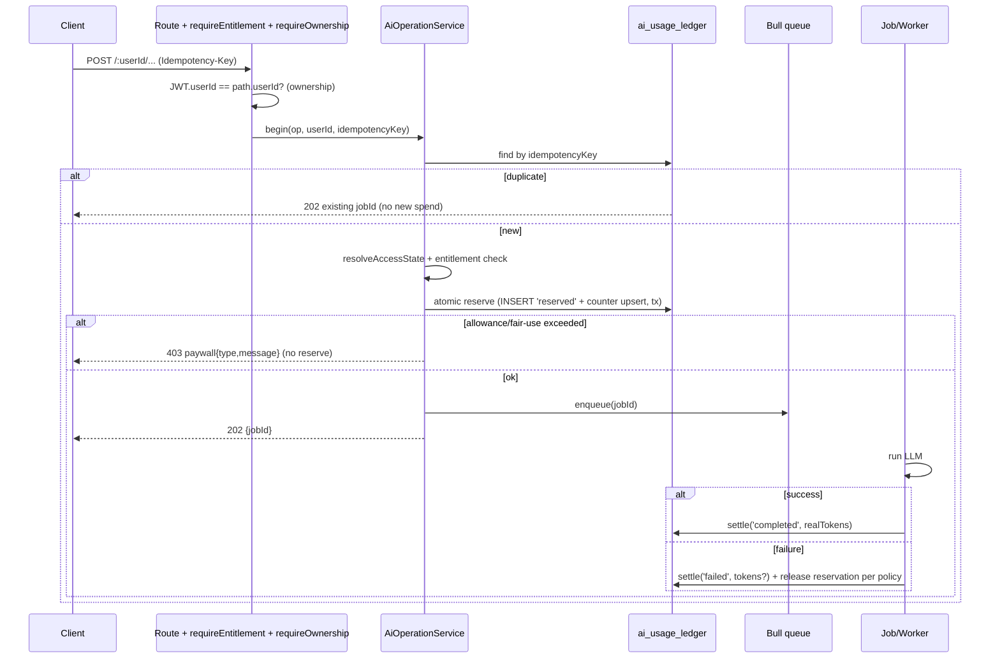

# MastersFit Free-vs-Paid Subscription Redesign — Implementation Plan

**Status:** Planning only. No code, schema, migration, config, test, or copy changes made.
**Date:** 2026-07-13
**Scope:** Backend (`masters-fit-backend`) + Frontend (Expo RN). Verified end-to-end via source audit + live token metrics (local + prod, read-only).

> **Verification convention.** Every current-state claim is marked **[V]** (verified in code, with file:line) or **[U]** (uncertain/inferred). Recommendations are labelled **[R]**. Product forks are consolidated in §4.

---

## 1. Executive Summary

**What exists today.** MastersFit has a single server-enforced gate: **AI workout generation/regeneration**, protected on exactly four routes in `backend/src/routes/workout.routes.ts` (generate-async, regenerate-async weekly, regenerate-async daily, rest-day-workout) **[V]**. Everything else — logging, history, analytics, health sync, repeat-week/day, manual exercise edits — is **completely ungated** (only bearer-auth, and several routes lack even that) **[V]**. Access is derived at request time from `user_subscriptions.status` → `AccessLevel {UNLIMITED, TRIAL, BLOCKED}`; trial usage is three lifetime counters (`weeklyGenerationsCount`, `dailyRegenerationsCount`, `tokensUsed`) in `trial_usage` **[V]**.

**Why it does not cleanly support the proposed model.** Five structural problems:

1. **Entitlements and usage are conflated.** There is no notion of "can this tier do X." Access is a 3-value enum consumed only by generation guards. The desired model needs per-capability entitlements (logging, history, analytics, health) that today have *no enforcement surface at all*.
2. **The AI gate is incoherent.** Initial generation is gated by "does any `workouts` row exist" (`userHasWorkoutHistory`, counts ANY row) **[V]**; regenerations are gated by lifetime counters with **OR logic** where the token cap is actually the binding constraint (measured: ~20k tokens/regen vs a 50k cap ⇒ ~2–3 regens, not the "2 weekly + 5 daily" the names imply) **[V, measured]**. Weekly *generation* never increments any counter; only *regeneration* does **[V]**.
3. **The names lie.** "weekly"/"daily" counters are lifetime and never reset (no cron, no reset column) **[V]**. User-facing and backend copy hardcode "2 total lifetime"/"5 total lifetime"/token language that will be wrong under any new model.
4. **Enforcement is unsafe.** Systemic IDOR (path `:userId` is never checked against the JWT; TSOA `@Security` is not wired — hand-written routers bypass it) **[V]**; non-atomic check-then-increment allows allowance overrun under concurrency **[V]**; no idempotency (unique Bull jobId per request defeats dedup — double-tap enqueues two generations) **[V]**; webhook has no signature verification and is fully open if an env var is unset **[V]**.
5. **Billing plumbing is half-built.** RevenueCat prod keys are `test_`-prefixed placeholders and absent from `eas.json` **[V]**; the RC webhook is the *only* server source of truth (no receipt validation, no out-of-order protection) **[V]**; a just-subscribed user can still be 403'd until the webhook lands, with no client→server sync endpoint **[V]**; no mid-action resume after purchase **[V]**.

**Recommended target architecture [R].** Separate **access-state resolution** (subscription row → tier) from **entitlements** (tier → capability map, config-driven, server-enforced by a `requireEntitlement()` middleware) from **usage control** (an append-only **AI-usage ledger** + atomic per-user counters, consumed only for AI operations). Route every AI action through one **AI-operation service** that resolves access → checks entitlement → atomically reserves usage → enqueues with an **idempotency key** → records ledger start/complete/fail → attributes real tokens. Keep allowances/flags in a **DB-backed product-config table** (extend `system_config`) with env fallback and a short-TTL cache. Server remains source of truth; client gating is UX-only.

**Estimated complexity.** Medium-Large. ~6–10 focused weeks of eng if done in the recommended phased order, front-loaded by security fixes (IDOR, webhook, atomic usage) that are *prerequisites, not optional*. The entitlement layer is additive and low-risk; the risky work is migration of existing `trial_usage` and the billing hardening.

**Highest-risk areas.** (1) IDOR + non-atomic usage (security, live today); (2) migration of existing free/paid users without breaking anyone or gifting/removing access unfairly; (3) webhook race + no receipt validation (a paid user seeing a paywall is a refund/review risk); (4) copy/limit language that misstates the model on the store listing (App Store review risk).

---

## 2. Verified Current-State Architecture

### 2.1 Access + subscription state [V]
- `subscription.service.ts`: `getUserSubscription` auto-creates a `TRIAL` row if none (`:33-49`, `:54-84`); **no caching** anywhere in service/middleware. `getEffectiveAccessLevel` (`:89-132`): `ACTIVE`→UNLIMITED; `GRACE_PERIOD`/`CANCELLED`→UNLIMITED while `subscriptionEndDate > now` else BLOCKED; `TRIAL`→TRIAL; `EXPIRED`/`PAUSED`/other→BLOCKED.
- Constants `constants/subscription.ts`: `TRIAL_LIMITS {WEEKLY_GENERATIONS:2, DAILY_REGENERATIONS:5, TOKEN_CAP:50000}`; `AccessLevel {UNLIMITED,TRIAL,BLOCKED}`; `SubscriptionStatus {TRIAL,ACTIVE,EXPIRED,CANCELLED,GRACE_PERIOD,PAUSED}`.

### 2.2 The four guarded routes [V] (`workout.routes.ts`)
| Route | Guard | Operation semantics |
|---|---|---|
| `POST /:userId/generate-async` `:161` | `subscriptionGuardWithOnboarding()` | allow iff `!userHasWorkoutHistory`; else require UNLIMITED |
| `POST /:userId/regenerate-async` `:179` | `subscriptionGuard("regeneration","weekly")` | OR-check 3 caps; job bumps `weeklyGenerationsCount` |
| `POST /:userId/days/:planDayId/regenerate-async` `:204` | `subscriptionGuard("regeneration","daily")` | OR-check 3 caps; job bumps `dailyRegenerationsCount` |
| `POST /:userId/rest-day-workout` `:328` | `subscriptionGuard("generation")` | token-cap-only check; **but enqueued as daily-regen** ⇒ bumps `dailyRegenerationsCount` |

- `subscriptionGuard` (`subscription.middleware.ts:90-222`) **checks but never increments**. `subscriptionGuardWithOnboarding` (`:232-328`) gates on `userHasWorkoutHistory` (`workout.service.ts:293-301`, `count(*)>0` over `workouts`, any row).
- **No other endpoint anywhere is subscription-gated** [V] — analytics, dashboard, logs, health, repeat, exercise-edit, export: none.

### 2.3 Generation pipeline [V]
- Single Bull queue `"workout generation"` (`queues/workout-generation.queue.ts:84`), 3 processors at concurrency 10 (`index.ts:74-76`); `lockDuration 120000`, `attempts:3`, exp backoff. Lock comment documents the past duplicate/orphan incident.
- Weekly generation: **LLM first, DB row after** (`workout.service.ts:957-1003` throw-before-write; `createWorkout` at `:1025`). ⇒ a *fully failed* LLM leaves no `workouts` row (allowance safe). **[U] residual:** plan-day/exercise inserts are non-transactional after `createWorkout` (`:1034-1046`, `:2044/:2104`); a mid-persistence failure leaves a `workouts` row that permanently trips `userHasWorkoutHistory`.
- **Rest-day generation creates the `workouts`/plan-day row BEFORE the LLM** (`controller:861/868`, `workout.service.ts:2522`); best-effort cleanup on failure (`cleanupFailedRestDayGeneration`, swallows errors) ⇒ crash leaks a row + the allowance.
- **Weekly generation job never touches trial usage** (no subscription import in `workout-generation.job.ts`). Regeneration jobs `incrementTrialUsage` AFTER success (`workout-regeneration.job.ts:191-198`, `daily-regeneration.job.ts:198-205`).
- **No idempotency / per-user concurrency guard**: DB job id → unique Bull jobId per request → dedup never fires; frontend guards are UI-only (`background-job-context.tsx:317-345`).
- **Retry double-spend [V path]:** if a post-LLM step throws on a non-final attempt, Bull re-runs the processor ⇒ LLM re-invoked + `incrementTrialUsage` re-applied; no compensating decrement anywhere.

### 2.4 Token accounting [V + measured]
- `llm_generation_logs` (`llm-generation-logs.schema.ts`): per successful call — operation, provider, model, planning/day model, durationMs, input/output/total tokens, cacheRead/cacheCreation. **No cost column.** Failed calls not recorded; a retry writes a second (accurate) row. Fire-and-forget insert.
- `trial_usage.tokensUsed` is a *separate* counter fed from an in-memory `lastTokenUsageByUser` map (`prompts.service.ts:37`, process-local, lost on restart). **Two divergent token stores, no join key to jobs.**
- Admin `GET /api/admin/llm-metrics` (`llm-metrics.routes.ts`): bearer-only, **no admin role check**; `getReport` groups by (operation,provider,model) with p50/p95 duration + cacheHit%, **no cost**.

**Measured token usage (live `llm_generation_logs`).** Prod sample is small (5 users, 61 ops, 2026-06-16→29) — treat as directional, re-measure post-launch:

| Operation | Model | n | p50 total | p95 total | max | p50 in / out | p50 cache-read | p50 dur |
|---|---|---|---|---|---|---|---|---|
| generateWeeklyWorkout | sonnet-4-5 | 24 (prod) | 119,032 | 141,080 | 141,174 | 108,662 / 10,436 | 147,016 | 24.9s |
| generateWeeklyWorkout | sonnet-4-6 | 10 (prod) | 68,462 | 69,145 | 69,145 | 61,566 / 6,935 | 65,088 | 22.1s |
| regenerateWorkout | sonnet-4-6 | 16 (prod) | 19,816 | 20,601 | 20,680 | 17,546 / 2,270 | 0 | 35.1s |
| regenerateWorkout | sonnet-4-5 | 11 (prod) | 21,996 | 22,596 | 22,974 | 19,967 / 2,040 | 0 | 35.8s |

**Critical implication:** one weekly generation (~68–119k total tokens) **exceeds the entire 50k trial token cap** — but generation doesn't consume the token counter, so it's irrelevant there. Each regeneration is ~20k tokens. With the 50k cap + OR logic, a trial user is blocked after **~2–3 regenerations**, *not* the "2 weekly + 5 daily = 7" the counters imply. The token cap is the true binding limit and it is **stricter and more opaque** than the advertised counts. Also the request-time check uses a hardcoded 2,000-token estimate (`subscription.middleware.ts:20-24`) — a 10× under-count vs reality — so the cap leaks by roughly one extra op.

### 2.5 Billing / RevenueCat [V]
- Webhook `POST /subscriptions/webhooks/revenuecat` (`subscription.controller.ts`): auth is a **plain shared-secret header** compare (`:140-161`); **if `REVENUECAT_WEBHOOK_AUTH_HEADER` is unset, ALL requests accepted** (`:162-172`). No HMAC/signature. Idempotency via `webhook_events.eventId` unique (`:200-219`) but check+mark are two statements, not atomic. **No out-of-order protection** — `updateUserSubscription` blind-overwrites (`service:362-391`). Handles INITIAL_PURCHASE/RENEWAL/CANCELLATION/UNCANCELLATION/NON_RENEWING/EXPIRATION/BILLING_ISSUE(→GRACE)/PRODUCT_CHANGE/TRANSFER; PAUSED/ALIAS log-only; unknown ignored.
- **No server-side receipt validation; no RC REST calls.** Webhook is sole source of truth. **No client→server sync endpoint** (only `/plans`, `/status`, `/webhooks`).
- Client: `use-subscription-status.ts` treats "first active entitlement" as pro (no fixed entitlement ID, `:83-85`); reconciles against backend `/status`. Demo email `rtp+demo@mastersfit.ai` forced pro in all builds (`utils/demo-account.ts`). Prod keys are `test_` placeholders, not in `eas.json` ⇒ SDK may never configure in prod ⇒ paywall "couldn't load plans."
- Purchase UX: `payment-wall-modal.tsx` fires `PAYWALL_VIEWED`/`CHECKOUT_STARTED`/`RESTORE_TAPPED`; hook fires `PURCHASE_COMPLETED`/`TRIAL_STARTED`/`PURCHASE_FAILED`. **No mid-action resume** after purchase. `paywallData.limits` is passed everywhere but **never rendered** — no free-tier usage meter.

### 2.6 Content flows (bypass surface) [V]
- **No non-generation flow calls an LLM or consumes tokens** — every LLM path is behind a guard. Exercise "substitution" = deterministic DB search + FK swap (`PUT /exercise/:id/replace`), no AI.
- **Ungated content routes:** `repeat-week` (`:280`, no auth), `repeat-day` (`:313`, auth only), `POST /:userId` create workout (`:43`), `POST /:workoutId/days` (`:76`, no auth), `POST /days/:planDayId/exercises` (`:95`, no auth), `PUT /exercises/:id` (`:114`, no auth), `DELETE/replace exercise`. A free user can re-instantiate an AI-generated week unlimited times and hand-edit their plan indefinitely — no new AI, but unlimited content re-arming.

### 2.7 Logging / history / analytics [V]
- Logging schema is rich (`logs.schema.ts`): set-level weight/reps/rest; exercise-level duration/time/notes/difficulty/rating; day-level HR/volume/mood; **RPE, distance, per-set completion = ABSENT.** All log routes bearer-only, **no subscription gate**.
- Completion is **separable** from detailed logging: `POST /logs/workout/day/{id}/complete` takes an optional body, sets `planDays.isComplete`; the streak reads only `isComplete`. But `getWeeklySummary` completion% keys off presence of `exerciseLogs` (`dashboard.service.ts:299`) — watch this dependency if logging becomes paid.
- History: `getWorkoutHistory` returns all past workouts, **no limit**; dashboard queries a 2020→2030 window and filters client-side. **No history-depth limit implemented anywhere.**
- Dashboard analytics: streak/weekly completion (engagement); weight-accuracy, strength progression, volume, workout-type distribution, goal progress (progress insight); HR/steps/calories (device health). **None gated.** 9 of 11 dashboard routes have **no auth at all** [V].
- Health: Apple Health + Health Connect **read-only, foreground, client-only** (never sent to backend, never in AI prompts); background-delivery entitlement declared but unused; **no disconnect/delete path** wired; Watch/Wear absent.
- Telemetry: Mixpanel (client SDK + backend forward), prod-gated by token; paywall/purchase funnel events fire; `WORKOUT_COMPLETED`/`EXERCISE_LOGGED`/`ONBOARDING_STEP_VIEWED` are **defined but never fired**. No backend events table (Mixpanel-only).

### 2.8 Schema [V]
- Push-based Drizzle (`drizzle-kit push`), **no migration files**; `db:migrate` is aliased to `push`; `db:check` is `printf '' | drizzle-kit push --verbose` (a preview, not `drizzle-kit check`). 22 tables.
- `trial_usage.userId` **UNIQUE** (dup rows impossible; increments still race). `user_subscriptions.userId` UNIQUE (one row/user). `user_subscriptions.planId` is a **loose string, not an FK** to `subscription_plans`. `webhook_events.payload` is `text` not `jsonb`, no user link.
- `workouts.isActive` is "the one current plan" (partial unique index), **not** soft-delete; **no delete cascades** through workout→planDays→blocks→exercises→logs (only `exercise_set_logs`→`exercise_logs` cascades). No entitlement/feature-flag table; closest is `system_config` (global k/v jsonb).

---

## 3. Gap Analysis

| # | Capability | Current [V] | Desired | Gap | Required change | Risk | Depends on |
|---|---|---|---|---|---|---|---|
| G1 | Onboarding | Free, ungated | Free, unrestricted | none | — | — | — |
| G2 | Initial plan (1, lifetime) | Gated by "any workouts row exists" | 1 lifetime free initial plan, reinstall/device-safe | Gate is row-existence, not "a real initial plan"; partial-fail/rest-day rows corrupt it | Replace with explicit `initial_plan_generated` fact + usage-ledger event | Med | Ledger, access-state |
| G3 | Free lifetime adjustments (1 wk / 3 day) | 2 wk + 5 day counters, but token cap binds first (~2–3) | 1 week + 3 day, lifetime, explicit, configurable | Counts mislabeled/lifetime; token cap is the real limit; not configurable | New config + atomic ledger consumption; retire token-as-user-limit | Med | Config, ledger |
| G4 | View existing workouts | Free, ungated | Free | none (verify downgrade) | Confirm no gate added | Low | Entitlements |
| G5 | Repeat day/week | Free, unlimited, **unguarded/partly unauth** | Free, must not yield new AI content | Repeat can re-arm never-completed AI weeks unlimited times; routes lack auth | Add auth + ownership; decide policy on repeat allowance (§4 D5) | Med | AuthZ fix |
| G6 | Basic completion tracking | Free, ungated; completion separable | Free "done"; depth is a product decision (§4 D2) | History depth undecided; weekly-summary keys off logs | Add history-window entitlement; repoint completion% off logs | Med | Entitlements, D2 |
| G7 | Exercise substitution | Deterministic, free, unguarded | Free deterministic (recommend) | No AI sub exists; routes unauth | Add auth; keep deterministic free; gate any *future* AI sub | Low | AuthZ fix |
| G8 | New plans after first (paid) | Blocked for non-UNLIMITED after history exists | Paid: ongoing new plans, fair-use | Works, but coupled to row-existence hack; no fair-use ceiling | Entitlement `can_generate_new_plan` + fair-use limiter | Med | Ledger, entitlements |
| G9 | Ongoing adjustments (paid) | Counters block paid too only if not UNLIMITED (UNLIMITED skips) | Paid: unlimited-feeling, fair-use safeguards | No fair-use ceiling for paid; "unlimited" language | Fair-use limiter (rate/day/concurrency) for PAID | Med | Ledger |
| G10 | Full detailed logging (paid) | Fully implemented, **ungated** | Paid: full set/rep/weight/etc. | No gate; RPE/distance/per-set completion absent | `can_log_detailed_workout` gate; keep free "complete" | Med | Entitlements, D2/D3 |
| G11 | Full history/progress (paid) | Implemented, ungated, unlimited | Paid: full history + analytics | No gate; no depth limit | `can_view_full_history` + window enforcement | Med | Entitlements, D2 |
| G12 | Advanced analytics (paid) | Implemented, ungated; 9/11 routes unauth | Paid: advanced; free: basic | No gate; **routes unauthenticated** | Add auth to all dashboard routes; classify + gate advanced | High (authz) | AuthZ fix, D4 |
| G13 | Health integrations (paid) | Client-only, foreground, ungated | Paid: Apple Health + Health Connect | Gating a *client-only* read feature is UX-only, not server-enforceable today; no disconnect/delete | Client entitlement gate; add disconnect/delete; decide server enforcement (§4 D6) | Med | Entitlements, D6 |
| G14 | Future premium (adaptive, coach, export, wearables) | Absent | Extensible entitlements | No entitlement framework | Entitlement registry designed for extension | Low | Entitlements |
| G15 | Server-authoritative enforcement | IDOR; no path/JWT check; TSOA @Security dead | All premium/AI ops server-enforced by owner | Systemic IDOR undermines every gate | Ownership middleware (path==JWT); enforce on all `/:userId/*` | **High** | — (prereq) |
| G16 | Atomic usage | Non-atomic check-then-increment; no idempotency | Concurrency-safe, idempotent | Overrun + double-spend possible | Atomic SQL upsert / row lock; idempotency keys | High | Ledger |
| G17 | Billing integrity | Open webhook, no receipt validation, no sync endpoint, prod keys broken | Verified webhook, post-purchase sync | Paid users can be 403'd; webhook spoofable | Webhook signature, `/subscriptions/sync`, fix EAS keys | High | — |
| G18 | Terminology | "weekly/daily/unlimited", hardcoded 2/5 | Accurate, config-driven | Misleading everywhere | Copy pass (client + backend messages) | Low | Config, model finalized |

---

## 4. Product Decisions Requiring Confirmation

> These block implementation. Each has a recommendation; **D1, D2, D5, D8 are the load-bearing ones.**

**D1 — Free AI adjustment allowances (exact numbers + reset semantics).**
Why it matters: defines the free ceiling and the paid value proposition; drives config schema and migration.
Options: (a) **1 week + 3 day, lifetime** (your working rec); (b) 1 week + 3 day that renew (e.g., monthly); (c) a single unified "N AI adjustments" pool.
**Recommendation: (a) lifetime**, made explicit in naming/logic/analytics, values in config. Lifetime maximizes conversion pressure and is simplest to reason about; a renewing free tier risks becoming "permanently sufficient," which contradicts strategy. Consequence: retire the token cap as a *user-facing* limit (keep it as an internal guardrail, §9); the ledger records `free_week_adjustments_used`/`free_day_adjustments_used`.

**D2 — Free history/completion depth (Option A/B/C).**
Why it matters: affects retention, the logging/analytics gate, and query changes.
Options: A current week only; B current + previous week; C all past content viewable, but detailed logging + analytics are paid.
**Recommendation: C.** Never hide a user's own generated content (matches your downgrade principle and avoids "data hostage" App-Store friction). Make the *paid* line detailed logging + progress analytics + long-range trends, not visibility of past workouts. Consequence: `can_view_full_history` becomes about **analytics depth**, not raw workout visibility; must repoint `getWeeklySummary` completion% off `exerciseLogs` (G6) so free "complete" still counts.

**D3 — Free logging depth.**
Why it matters: is "mark complete" free while detailed set/rep/weight capture is paid?
Options: (a) free = mark-complete + basic; paid = detailed set/rep/weight/notes/history; (b) all logging free, only analytics paid; (c) all logging paid.
**Recommendation: (a).** Completion is already separable (§2.7). Free users get "done" + streak; MastersFit+ gets the full set-tracker + performance history. Consequence: client must support a lightweight complete path without SetTracker; server gate on log-write endpoints.

**D4 — Basic vs advanced analytics boundary.**
Why it matters: defines the paid analytics surface and which dashboard sections gate.
**Recommendation:** Free = streak, weekly completion, today's workout, device-health carousel (operational/engagement). Paid = weight-accuracy, strength progression, volume trends, workout-type distribution, goal progress, PRs (progress insight). Consequence: gate those dashboard sections client-side and their endpoints server-side (after adding auth to the 9 unauthenticated ones).

**D5 — Repeat policy for free users.**
Why it matters: repeat-week/day currently lets a free user re-arm AI content unlimited times, including never-completed weeks (§2.6).
Options: (a) unlimited repeat of *completed* content only; (b) unlimited repeat of any owned content; (c) limited repeats.
**Recommendation: (a).** Repeating truly-used content is fair and consumes no AI; but block repeating a never-started AI week (that's a disguised re-roll). Enforce "repeatable = has completion history" server-side (the picker already computes `isRepeatablePreviousWorkout`; the week-modal + backend do not). Consequence: add completion filter to `repeat-week` service + auth/ownership.

**D6 — Health sync gating + server enforcement.**
Why it matters: health is client-only today; a client-only gate is bypassable and there's no disconnect/delete.
Options: (a) gate client-side only (accept it's cosmetic since data never leaves device); (b) keep health **free** (it's a retention/engagement hook, not a cost center, and gating a local read is weak); (c) gate client-side now, make it server-enforceable only if/when health data is sent server-side or used in prompts.
**Recommendation: (b) for launch, design for (c).** Health reads cost nothing and drive engagement; making them paid gates a feature we can't truly enforce and can't cleanly revoke. Revisit when health data feeds adaptive programming (then it's genuinely premium and server-side). Regardless: **add a disconnect/delete-data path now** (currently absent) — required for privacy/store compliance.

**D7 — Downgrade behavior (precise matrix).** See §8. **Recommendation** (matches your stated preference): never hide/delete owned content; repeating owned+completed content stays free; new AI generation + detailed logging + advanced analytics require active sub; historical detailed logs/analytics become **read-only** after downgrade (viewable, not extendable); health stays connected but user can always disconnect/delete; never block data export/delete.

**D8 — Migration policy for existing users.** See §10. **Recommendation: translated allowance, not literal preservation** — grant every existing user a clean free allowance under the new model unless they're paid, with a one-time "you've been credited" framing. Literal preservation of the misleading counters would import the confusion and unfairly penalize users who "spent" allowances under an opaque token cap.

**D9 — Is the token cap ever user-facing?**
**Recommendation: No.** Keep tokens as an internal cost guardrail + anomaly signal (§9). Users see operation counts ("adjustments"), never tokens/credits.

**D10 — Grace-period AI access.**
Why it matters: billing-issue users currently get UNLIMITED until `subscriptionEndDate`.
**Recommendation:** keep UNLIMITED during grace (don't punish a card hiccup); surface a "update payment" banner. Consequence: entitlement resolver treats GRACE == PAID.

**D11 — Promotional/complimentary/admin access mechanism.**
Why it matters: none exists server-side today (only a client demo-email hack + a trial-reset script).
**Recommendation:** add a first-class `PROMO`/`COMPLIMENTARY` access state with an optional expiry, set via admin tooling, resolved server-side. Consequence: new access-state enum value + admin endpoint (§7).

---

## 5. Recommended Target Architecture [R]

### 5.1 Three separate concerns

```
Subscription facts (RevenueCat + DB)  ──►  Access State  ──►  Entitlements (capability map)
                                                │
                                                └──►  Usage Controls (ledger + counters)  [AI ops only]
```

- **Access State** — pure resolver `resolveAccessState(subscription, now) : AccessState`. Extend today's enum to `FREE | PAID | GRACE | EXPIRED | PROMO | ADMIN | DEV`. (GRACE resolves to PAID entitlements per D10; PROMO/ADMIN/DEV are explicit.)
- **Entitlements** — a **config-driven capability map**: `Record<AccessState, Record<Capability, boolean>>`. Capabilities: `generate_new_plan`, `regenerate_week`, `regenerate_day`, `log_detailed_workout`, `view_full_history`, `view_advanced_analytics`, `sync_health` (see D6), `export_data`, `use_adaptive_programming` (future). Enforced by `requireEntitlement(cap)` middleware; also exposed read-only to the client via `/subscriptions/status` so UI can gate cosmetically.
- **Usage Controls** — apply **only to AI operations** and only when the access state is metered (FREE has finite allowances; PAID has fair-use ceilings). Backed by an append-only **AI-usage ledger** + a small per-user counters projection for O(1) atomic checks.

### 5.2 AI operation model [R]

Represent every AI-backed action through one service with one lifecycle. Operation types: `initial_plan_generation | new_week_generation | week_regeneration | day_regeneration | rest_day_generation | ai_exercise_substitution(future) | coach_message(future)`.



- **Reservation** makes the check-and-consume atomic (fixes G16): a single transaction inserts a `reserved` ledger row and upserts the per-user counter with a conditional `WHERE count < limit`. Concurrency can't overrun.
- **Idempotency key** (client-generated per user action, echoed on retry) makes double-tap/timeout-retry safe (fixes the dedup gap).
- **Settle/refund policy** (config): failed LLM ⇒ release the reservation (don't charge the user) but still record tokens spent for cost tracking; succeeded ⇒ finalize. No more "retry double-charges."

### 5.3 Usage ledger vs counters [R] — **hybrid**
- **Append-only `ai_usage_ledger`** (auditable truth): one row per operation attempt with state transitions, tokens, cost, access-state-at-time, idempotency key, job id, failure reason, whether counted.
- **`ai_usage_counters`** projection (one row/user): the numbers the atomic reserve checks (`free_initial_used`, `free_week_adj_used`, `free_day_adj_used`, plus rolling paid fair-use windows). Rebuildable from the ledger (reconciliation job).
- Trade-off: two structures vs one. Justified — counters give O(1) atomic gating; ledger gives audit/reconciliation/cost analytics and replaces the two divergent token stores. `trial_usage` is migrated into counters and retired.

### 5.4 Configuration [R] — DB-backed product config + env fallback
- Extend `system_config` (already a k/v jsonb table) with a `product_config` namespace holding: free allowances (initial/week/day), per-capability free/paid flags, paid fair-use thresholds (per-hour/day, concurrency, cooldown), token anomaly thresholds, promo defaults, history window. **In-memory cache with short TTL (e.g., 60s)** + startup load; env vars only as bootstrap defaults. This is the "simplest appropriate" choice — no external feature-flag platform, admin-editable, auditable. (A full feature-flag service is over-engineering at this stage.)

### 5.5 Server/client responsibilities
- **Server = source of truth**: ownership, entitlements, usage, billing state. All AI + premium-write endpoints enforce server-side.
- **Client = UX only**: reads entitlements from `/subscriptions/status`, hides/gates affordances, renders the usage meter, shows the paywall. Never the sole gate.

### 5.6 Background jobs
- Jobs read the reservation, not the guard. Idempotent by ledger id. Per-user concurrency cap enforced at reserve time (config). Settle on completion/failure.

### 5.7 Analytics + admin
- Server-authoritative funnel events emitted at reserve/settle/paywall points (§13/§ events). Admin surface for access-state overrides, usage inspection, ledger reconciliation, cost dashboards.

---

## 6. Recommended Database Changes [R] (design only — no migration written)

| Change | Purpose | Shape | Constraints/Index | Migration/backfill | Keep old? | Rollback |
|---|---|---|---|---|---|---|
| **New `ai_usage_ledger`** | Append-only AI op audit | id, userId FK cascade, operation, status(reserved/completed/failed/released), idempotencyKey, jobId FK, accessStateAtTime, inputTokens, outputTokens, totalTokens, estCostUsd, model, provider, failureReason, counted bool, createdAt, settledAt | UNIQUE(idempotencyKey); idx(userId,operation,createdAt); idx(status) | none (new) | n/a | drop table |
| **New `ai_usage_counters`** | Atomic gate projection | userId PK/FK cascade, freeInitialUsed int, freeWeekAdjUsed int, freeDayAdjUsed int, paidWindowStart, paidOpsInWindow, updatedAt | PK(userId) | backfill from `trial_usage` per D8 | keep `trial_usage` read-only during shadow | restore from `trial_usage` |
| **New `product_config`** (or `system_config` rows) | Allowances/flags/thresholds | key, jsonb value, updatedAt | UNIQUE(key) | seed defaults from current constants | n/a | delete rows |
| **New `entitlement_overrides`** (optional) | Promo/comp/admin grants | userId FK, accessState, expiresAt, reason, grantedBy, createdAt | idx(userId), idx(expiresAt) | none | n/a | drop |
| `user_subscriptions.planId` → FK | Integrity | add FK to `subscription_plans.planId` (or planId int) | FK | backfill/validate existing strings | keep string col during transition | drop FK |
| `user_subscriptions.status` | Add PROMO/COMP/ADMIN/DEV if used | extend allowed values (text today) | — | none | — | — |
| `webhook_events`: add `userId`, `status`, `error`, `payload`→jsonb, `eventTimestampMs` | Ordering + debuggability | add columns | idx(userId); idx(eventTimestampMs) | backfill best-effort | keep text payload temporarily | drop columns |
| `workouts`: add `origin` enum (ai_initial/ai_new_week/ai_regen/repeat/manual/rest_day) + `generationStatus` | Distinguish real plans from partial/rest-day/manual rows (fixes G2 corruption) | add columns | idx(userId,origin) | backfill by heuristic | — | drop |
| Add delete cascades workout→children (or documented soft-delete) | Safe deletion + accurate history gating | FK onDelete cascade OR `deletedAt` | — | careful — behavioral | evaluate both | revert FK |
| `exercise_set_logs`: add `rpe`, `distance`, `completed`, `timeSeconds` (if D3 paid features promised) | Net-new logging | nullable columns | — | none | — | drop |
| Adopt real Drizzle migrations (`generate`+`migrate`) | Auditable schema history | tooling, not schema | — | one-time baseline | keep push for dev | — |

**Backfill note:** all backfills run in Phase 1/2 behind flags with shadow verification; no destructive change until Phase 6. Given push-based deploy with no migration history, **introducing `drizzle-kit generate/migrate` is itself a recommended foundation item** (the current `db:migrate == push` and empty `db:check` are unsafe for a change of this blast radius).

---

## 7. Recommended API & Service Changes [R]

| Endpoint/Service | Current | Proposed | Guard | Errors | Idempotency | Accounting | Analytics | Compat |
|---|---|---|---|---|---|---|---|---|
| `POST /:userId/generate-async` | onboarding-gate (row exists) | `requireOwnership`→`requireEntitlement(generate_new_plan OR free-initial-unused)`→reserve | ownership+entitlement+usage | 403 paywall{type} | Idempotency-Key | ledger initial/new-week | reserve+settle events | keep 202 shape |
| `POST /:userId/regenerate-async` | OR-counter check | ownership→entitlement(regenerate_week)→reserve(free_week_adj or paid fair-use) | same | 403 paywall | key | ledger week_regen | events | same |
| `.../days/:id/regenerate-async` | OR-counter check | ownership→entitlement(regenerate_day)→reserve | same | 403 | key | ledger day_regen | events | same |
| `POST /:userId/rest-day-workout` | token-only guard; row created pre-LLM; counter mismatch | fold into AI-op model; create row only after LLM or mark provisional; correct op type | same | 403 | key | ledger rest_day | events | fix row-leak |
| `repeat-week` / `repeat-day` | unguarded/unauth; can re-arm never-used AI weeks | `requireOwnership`; enforce "repeatable=completed" (D5); no AI ⇒ no reserve | ownership | 403/404 | n/a | none | repeat_* events | add auth |
| create workout / add day / add-exercise / update / replace / delete exercise | several unauth | `requireOwnership` on all; no subscription gate (deterministic) | ownership | 401/403 | n/a | none | none | add auth |
| Logs write endpoints | bearer-only | `requireOwnership`; if detailed logging (D3) `requireEntitlement(log_detailed_workout)`; keep `complete` free | ownership(+entitlement) | 403 paywall | n/a | none | logging_attempted | add auth+gate |
| Dashboard analytics (11 routes, 9 unauth) | mostly unauth, ungated | `requireOwnership` on ALL; advanced ones `requireEntitlement(view_advanced_analytics)` | ownership(+entitlement) | 401/403 | n/a | none | analytics_attempted | **add auth first** |
| Health | client-only | client entitlement gate (D6); add disconnect/delete client APIs | client | — | n/a | none | health_sync_attempted | — |
| **NEW** `POST /subscriptions/sync` | absent | client posts CustomerInfo/receipt post-purchase; server validates w/ RC REST + updates status immediately (fixes webhook race) | ownership | 400/401 | receipt id | none | subscription_synced | new |
| `POST /subscriptions/webhooks/revenuecat` | shared-secret/open | **require signature**; reject if secret unset; store eventTimestampMs; ignore stale/out-of-order; atomic dedup | signature | 401 | eventId | none | webhook_processed | harden |
| `GET /subscriptions/status` | reads DB | also return resolved entitlements + usage meter (used/limit per free allowance) | ownership | — | n/a | none | — | extend |
| `GET /api/admin/llm-metrics` + **NEW** admin usage/override | bearer-only, no role | require admin role; add cost; add access-override + ledger-reconcile endpoints | admin | 403 | n/a | none | admin_action | secure |

**Cross-cutting [R]:** introduce `requireOwnership` (path `:userId` must equal JWT userId; 403 otherwise) and apply to **every** `/:userId/*` route — this fixes the systemic IDOR (G15) and is a prerequisite for any entitlement to be meaningful.

---

## 8. Free vs MastersFit+ Entitlement Matrix [R] (pending D2–D6)

| Feature | Free | MastersFit+ | After downgrade | AI consumed? | Usage limit? | Paywall trigger | Server enforcement point |
|---|---|---|---|---|---|---|---|
| Onboarding | ✅ | ✅ | ✅ | no | no | none | — |
| Initial plan (1) | ✅ once | ✅ | view only | yes | free: 1 lifetime | 2nd new plan | AI-op reserve |
| New weekly plan (ongoing) | ❌ | ✅ (fair-use) | ❌ | yes | paid: fair-use | on attempt when free/expired | requireEntitlement+reserve |
| Week adjustment | ✅ 1 lifetime | ✅ (fair-use) | ❌ new; view old | yes | free:1 / paid:fair-use | after free used | requireEntitlement+reserve |
| Day adjustment | ✅ 3 lifetime | ✅ (fair-use) | ❌ new; view old | yes | free:3 / paid:fair-use | after free used | requireEntitlement+reserve |
| View existing/ past workouts | ✅ (D2=C) | ✅ | ✅ | no | no | none | ownership only |
| Repeat completed day/week | ✅ | ✅ | ✅ | no | no | none | ownership (+completed filter) |
| Repeat never-started AI week | ❌ (D5) | ✅ | — | no | no | on attempt | ownership+repeatable check |
| Mark complete (basic) | ✅ | ✅ | ✅ | no | no | none | ownership |
| Detailed set/rep/weight logging | ❌ (D3) | ✅ | read-only | no | no | on log attempt | requireEntitlement |
| Basic analytics (streak/weekly) | ✅ | ✅ | ✅ | no | no | none | ownership |
| Advanced analytics (progression/volume/PR) | ❌ (D4) | ✅ | read-only | no | no | on open | requireEntitlement |
| Full history depth | basic (D2) | ✅ | ✅ view | no | no | on advanced view | requireEntitlement |
| Apple Health / Health Connect | ✅ (D6=b) | ✅ | ✅ | no | no | none (launch) | client (server later) |
| Disconnect/delete health data | ✅ (new) | ✅ | ✅ | no | no | none | client |
| Data export | future | ✅ future | ✅ | no | no | on attempt | requireEntitlement |
| Adaptive/coach (future) | ❌ | ✅ future | ❌ | yes | fair-use | on attempt | requireEntitlement+reserve |

---

## 9. AI Cost-Control Plan [R]

**Measured baseline** (§2.4; small prod sample — re-measure): weekly generation ~68k (sonnet-4-6) / ~119k (sonnet-4-5) total tokens; regeneration ~20k. Input dominates; large cache-read on generation (prompt caching working for generation, not regen). No cost column exists — **add `estCostUsd`** to the ledger using per-model input/output/cache rates so cost is first-class.

**Free allowances (D1):** 1 initial + 1 week adj + 3 day adj, lifetime. Rough worst-case free-user LLM cost = 1 gen (~120k) + 4 adj (~80k) ≈ 200k tokens lifetime — bounded and cheap. **Retire the 50k token cap as the free limit** (it's stricter than intended and opaque); keep a token figure only as an internal anomaly guardrail.

**Paid fair-use safeguards (never say "unlimited"):** all config-driven, sized so normal use never hits them:
- Per-hour op limit (e.g., 10 AI ops/hr) and per-day (e.g., 30/day) per user.
- Max concurrent AI jobs per user = 1 (reject/queue a second) — also fixes the concurrency race.
- Cooldown between identical ops (e.g., 30s) + **idempotency** to collapse double-taps.
- Anomaly detection: alert when a user's daily token/cost exceeds a soft threshold; hard cap far above (kill-switchable).
- Admin override to lift limits for a user.

**Accounting rules:** reserve at request; settle with real tokens at completion; **failed LLM ⇒ release reservation (user not charged an allowance) but still log tokens/cost**; retries settle once (idempotent) — fixes the current double-charge. Refund policy in config.

**Alerts/dashboards:** cost-per-free-user, cost-per-converted-user, cost-per-paid-subscriber, p50/p95 tokens by op, failure-related spend, anomaly alerts. Extend the admin llm-metrics report with cost + per-access-state breakdown.

---

## 10. Migration Plan [R]

**Population inventory to handle:** free users with 0 workouts; free with ≥1 workout; free who consumed some/all regen allowances; free over the 50k token count; active paid (monthly/annual); former paid; test/seeded users; users with missing/duplicate `trial_usage`; users with multiple/partial `workouts` rows.

**Option 1 — Strict preservation.** Translate old counters 1:1 (used weekly→used week-adj, etc.), keep token spend. *Fair-ish but imports the opaque token cap and the mislabeled counts; users who hit the leaky token cap already "lost" allowances they didn't understand.*

**Option 2 — Translated clean allowance (Recommended, D8).** On migration, compute each user's new counters as: `freeInitialUsed = (has a real AI-origin initial plan ? 1 : 0)` (using the new `workouts.origin`, not raw row-existence — this *un-corrupts* users whose allowance was consumed by a partial/rest-day row); `freeWeekAdjUsed = min(old weekly, new limit)`; `freeDayAdjUsed = min(old daily, new limit)`; ignore token count entirely. Paid users unchanged (entitlements flow from status). Former paid → FREE with allowances per above. Promo/admin via new override table. Duplicate/missing `trial_usage` reconciled to one counters row.
- **Fairness:** users generally gain clarity and often *regain* an allowance that a partial row had eaten. Conversion impact: neutral-to-positive. Complexity: moderate (one backfill script + reconciliation). Support: a single clear message ("your free adjustments were refreshed under the new MastersFit+ model").

**Execution:** backfill in Phase 1 into new tables while `trial_usage` stays authoritative; **shadow-compare** old vs new gating decisions in Phase 2; cut over in Phase 4/5; retire `trial_usage` in Phase 6.

---

## 11. Test Plan [R]

**Scenario matrix (access states × operations):** FREE, PAID-monthly, PAID-annual, GRACE, EXPIRED, CANCELLED-in-period, PROMO, ADMIN, DEV × {initial gen, new-week gen, week regen, day regen, rest-day, repeat, detailed log, complete, advanced analytics, health}.

- **Unit:** `resolveAccessState` (all statuses/dates incl. boundaries), entitlement map lookups, config resolution + cache TTL, cost calc, reservation math.
- **DB:** counters upsert atomicity; ledger state transitions; backfill correctness on each population (incl. partial/duplicate rows); FK cascades.
- **API authorization (critical, covers IDOR):** every `/:userId/*` route rejects mismatched JWT vs path (G15); premium endpoints 403 when client bypassed; unauth routes now require auth.
- **Concurrency:** two simultaneous regens with 1 allowance left ⇒ exactly one succeeds; double-tap with same idempotency key ⇒ one job, one charge; concurrency cap enforced.
- **Background jobs:** LLM failure ⇒ no allowance charged, no partial workout consumes initial allowance; retry ⇒ single settle; success-then-post-step-failure ⇒ no double charge.
- **Subscription lifecycle:** each webhook type transitions correctly; out-of-order/stale event ignored; unsigned/unsecured webhook rejected; restore; platform switch; dual-platform; transfer; `/subscriptions/sync` flips access immediately post-purchase (webhook-race test).
- **Repeat bypass:** free user cannot repeat a never-started AI week; can repeat completed content; repeat never calls LLM.
- **Downgrade:** matrix in §8 (view yes, new-AI no, logs read-only, health disconnectable, export allowed).
- **Migration tests:** existing paid retains access; existing free gets correct translated allowance; corrupted-allowance user regains initial.
- **Client UI:** paywall triggers at the right points and not before first plan; usage meter renders `limits`; entitlement-driven show/hide; restore; sandbox.
- **E2E:** onboarding→first plan→exhaust free adjustments→paywall→purchase→resume action→paid ops; analytics events fire once each (no double count).
- **Analytics validation:** each funnel event fires with required props, server-authoritative events emitted at reserve/settle, no dupes.

---

## 12. Rollout & Rollback [R]

- **Phase 1 — Instrumentation/observability, no behavior change.** Add ledger + counters (shadow-written), cost calc, funnel events, admin cost dashboard, adopt real migrations. Backfill new tables. Ship dark.
- **Phase 2 — New entitlement + AI-usage engine behind flags; shadow evaluation.** Compute new gating decision alongside the live one, log divergences; do not enforce. Fix security prereqs (ownership middleware, webhook signature, atomic reserve, `/subscriptions/sync`, EAS keys) — these can enforce immediately (they're correctness/security, not model changes).
- **Phase 3 — Internal/test accounts** flip to enforcement via config; validate matrix.
- **Phase 4 — Limited cohort** (e.g., 5–10% new signups) enforced; watch conversion, paywall exposure, cost, error rates, support tickets.
- **Phase 5 — Full rollout** (new model copy + store metadata updated together).
- **Phase 6 — Cleanup:** retire `trial_usage`, remove OR-logic/token-cap-as-limit, delete dead registry events, remove mislabeled constants/copy, remove legacy demo-email hack in favor of PROMO override.

**Feature flags:** `entitlement_engine_enabled`, `enforce_ai_usage`, per-capability gate flags, `use_sync_endpoint`. **Kill switches:** disable enforcement (fall back to old guard), disable a specific gate. **Rollback:** flags off → old `trial_usage` path resumes (kept intact through Phase 5). **Halt conditions:** conversion drop > X%, paywall shown to confirmed-paid users, cost anomaly, elevated 5xx on guarded routes, support spike.

---

## 13. Risk Register [R]

| Risk | Likelihood | Impact | Detection | Mitigation | Layer |
|---|---|---|---|---|---|
| Token-cost escalation | Med | High | cost dashboard, anomaly alerts | fair-use limits, concurrency cap, kill-switch | AI/backend |
| Subscription-state drift (webhook lag/order) | High (today) | High | reconcile job, status mismatch alert | `/subscriptions/sync` + receipt validation + eventTimestamp ordering | billing |
| Duplicate generations | High (today) | Med | dup ledger rows, cost | idempotency key + concurrency cap | jobs |
| Concurrent allowance overrun | Med | Med | ledger vs counter reconcile | atomic reserve (tx + conditional upsert) | backend/db |
| **IDOR (path userId)** | High (live) | **High** | authz tests, access logs | `requireOwnership` everywhere (prereq) | backend |
| Open/spoofable webhook | Med | High | reject-unsigned metric | signature verify, fail-closed if secret unset | billing |
| Data-migration errors | Med | High | shadow compare, dry-run counts | Phase-1 backfill + shadow, reversible | db |
| Health after downgrade | Low | Med | — | health free (D6) + disconnect path | client |
| Paywall overexposure / shown to paid | Med | High | paywall_viewed by access-state | sync endpoint, resume-after-purchase, meter before wall | client |
| Conversion damage | Med | High | funnel dashboards by cohort | phased cohort rollout, halt conditions | product |
| Incorrect analytics/double count | Med | Med | event QA, dedupe keys | server-authoritative events, idempotent emit | analytics |
| App Store / Play review (limits language, data-hostage, restore) | Med | High | pre-submit review | accurate copy, never hide owned data, working restore | store |
| User-support confusion (lifetime vs weekly) | High (today) | Med | ticket tags | copy pass + usage meter + migration message | copy/UX |
| RevenueCat prod keys broken | High (today) | High | "API key missing" Sentry | fix EAS env keys before any rollout | config |

---

## 14. Implementation Backlog [R]

> Sizes: S<½wk, M≈1wk, L≈2wk, XL>2wk. "PI" = product input required.

**Foundation**
- F1 Adopt real Drizzle migrations (generate/migrate; baseline current schema). Dep: none. AC: migrations dir + CI check. Risk: Med. **L.**
- F2 `resolveAccessState` pure resolver + expanded enum. Dep: none. AC: unit-tested all statuses. **M.**
- F3 `product_config` (extend system_config) + cache + env fallback + seed defaults. Dep: none. AC: config read/override, TTL. PI (values). **M.**
- F4 Entitlement capability map + `requireEntitlement`/`requireOwnership` middleware. Dep: F2,F3. AC: authz tests. Risk: High. **L.**

**Security (prerequisite — can ship before model)**
- S1 `requireOwnership` on all `/:userId/*` (fix IDOR). Dep: F4. AC: mismatch→403 across routes. Risk: High. **L.**
- S2 Add auth to unauthenticated routes (repeat-week, create/add/update exercise, 9 dashboard routes). Dep: none. AC: 401 without token. **M.**
- S3 Webhook signature verify + fail-closed + eventTimestamp ordering + atomic dedup. Dep: none. AC: unsigned rejected, stale ignored. Risk: High. **M.**
- S4 `POST /subscriptions/sync` + RC receipt validation. Dep: F2. AC: post-purchase access immediate. Risk: High. **L.**
- S5 Fix EAS RevenueCat prod keys (config only). Dep: none. AC: SDK configures in prod build. **S.** PI (keys).

**Database**
- D-1 `ai_usage_ledger` + `ai_usage_counters`. Dep: F1. AC: schema + indexes. **M.**
- D-2 `workouts.origin`/`generationStatus`. Dep: F1. AC: backfilled. **M.**
- D-3 `entitlement_overrides` (promo/admin). Dep: F1. AC: resolver honors. PI (D11). **S.**
- D-4 webhook_events hardening cols; planId FK; cascades/soft-delete decision. Dep: F1. AC: integrity. **M.**
- D-5 Logging net-new cols (rpe/distance/per-set completion) IF D3 promises them. PI (D3). **S.**

**Server / AI engine**
- A1 `AiOperationService` (reserve/settle/release, idempotency). Dep: D-1,F4. AC: concurrency+idempotency tests. Risk: High. **XL.**
- A2 Rewire 4 generation routes onto A1 + entitlements. Dep: A1. AC: matrix. **L.**
- A3 Fix rest-day row-before-LLM + op-type mismatch. Dep: A1. AC: no leaked rows. **M.**
- A4 Repeat completion filter + no-AI confirmation. Dep: S1. PI (D5). **S.**
- A5 Gate logging (complete free / detailed paid) + repoint weekly-summary completion off logs. Dep: F4. PI (D3). **M.**
- A6 Gate advanced analytics endpoints. Dep: S2,F4. PI (D4). **M.**
- A7 Cost calc + admin cost/usage/override/reconcile endpoints + admin role. Dep: D-1. **M.**

**Background jobs**
- J1 Jobs read reservation, settle/release, idempotent, per-user concurrency cap. Dep: A1. AC: retry no double-charge. **L.**

**Mobile client**
- C1 Read entitlements from `/status`; entitlement-driven gating util. Dep: S4. **M.**
- C2 Usage meter ("X of N adjustments") from `limits`. Dep: C1. **S.**
- C3 Resume-after-purchase for the interrupted AI action. Dep: S4. **M.**
- C4 Gate detailed logging UI / lightweight complete path. PI (D3). **M.**
- C5 Gate advanced analytics sections. PI (D4). **S.**
- C6 Health disconnect/delete path. PI (D6). **S.**
- C7 Idempotency-Key on AI requests. Dep: A1. **S.**

**Billing** — covered by S3/S4/S5 + C3.

**Analytics**
- N1 Server-authoritative funnel events at reserve/settle/paywall; wire dormant client events; dedupe. Dep: A1. **M.**
- N2 Conversion/cost dashboards. Dep: N1,A7. **M.**

**Health** — C6 (+ future server enforcement deferred per D6).

**Testing**
- T1 Authz/IDOR suite. Dep: S1. **M.**
- T2 Concurrency/idempotency/job-failure suite. Dep: A1,J1. **M.**
- T3 Subscription-lifecycle + webhook-race suite. Dep: S3,S4. **M.**
- T4 Migration/backfill tests. Dep: MIG1. **M.**
- T5 Client UI + E2E funnel. Dep: C1-C3. **L.**

**Migration**
- MIG1 Backfill counters from trial_usage (translated, D8) + reconciliation. Dep: D-1,D-2. PI (D8). Risk: High. **L.**
- MIG2 Shadow-compare old vs new gating. Dep: A1,MIG1. **M.**

**Rollout / Cleanup**
- R1 Flags + kill switches + dashboards + halt runbook. Dep: A1,N2. **M.**
- R2 Copy pass (client + backend messages, store metadata) once model final. PI (D1,D9). **M.**
- R3 Cleanup: retire trial_usage, OR-logic, token-cap-as-limit, mislabeled constants, demo-email hack, dead events. Dep: full rollout. **M.**

---

## 15. Recommended Implementation Sequence [R]

1. **Security prerequisites first (S1–S5).** The IDOR, open webhook, and broken prod keys are live liabilities and undermine *every* entitlement. Ownership + webhook signature + sync + real keys must land before any model work matters. These are shippable independently and improve the product today.
2. **Foundation (F1–F4).** Migrations tooling, access-state resolver, config, entitlement middleware — the substrate everything else builds on.
3. **Database (D-1…D-5) + Migration backfill (MIG1) in shadow.** Stand up ledger/counters/origin, backfill translated allowances while `trial_usage` stays authoritative.
4. **AI-operation engine (A1) + rewire generation (A2, A3, J1, C7).** The core: atomic, idempotent, refund-correct AI gating. This also retires the concurrency/double-charge bugs.
5. **Feature gates (A4–A6, C4–C6) per finalized D2–D6.** Logging, analytics, repeat, health.
6. **Client entitlement UX (C1–C3) + analytics (N1–N2).** Meter, entitlement gating, resume-after-purchase, funnel measurement.
7. **Shadow compare (MIG2) → cohort rollout (R1) → full → cleanup (R2, R3).**

Rationale: security is non-negotiable and independent; foundation unblocks parallel work; the AI engine is the highest-value/highest-risk core and is sequenced after its DB substrate; feature gates and client UX are additive; migration runs in shadow throughout so cutover is low-risk; copy/cleanup last so nothing user-facing misstates the model mid-flight.

---

## 16. Final Recommendation [R]

- **Is the proposed model technically sound?** Yes. The free = "1 plan + a few lifetime adjustments + full existing-content access" / paid = "ongoing evolving programming + detailed logging + progress + integrations" split maps cleanly onto an entitlement+usage architecture, and the measured token costs make the free tier cheap to offer. The strategy ("is it worth paying for?" vs "why keep paying?") is well-served by gating *ongoing* AI and *depth* rather than an opaque quota.
- **What to change before implementation:** finalize **D1, D2, D3, D5, D8** (allowances, history/logging depth, repeat policy, migration). Everything else has a safe default.
- **Decisions you must make first:** D1 (free allowances), D2 (history/completion depth — I recommend C), D3 (logging depth — recommend free-complete/paid-detailed), D5 (repeat policy — recommend completed-only), D8 (migration — recommend translated clean allowance). D6 (health free at launch) and D9 (tokens stay internal) I'd lock as recommended unless you object.
- **Evolve or replace?** **Evolve the data/billing plumbing, replace the gating model.** Keep `user_subscriptions`, RevenueCat integration, the jobs/queue, `llm_generation_logs`, and the paywall component. Replace the `AccessLevel`/`trial_usage`/OR-logic/`userHasWorkoutHistory` gating with the entitlement + AI-usage-ledger model. Do **not** preserve the misleading counters or the token-cap-as-user-limit.
- **Recommended next action:** confirm the five decisions above (I can turn them into a short decision doc), then I execute **Phase 1 (instrumentation) + the security prerequisites (S1–S5)** first — they're independently valuable, de-risk the rest, and change no user-facing behavior. Nothing will be implemented until you approve.

---

### Appendix — verification method
7 parallel read-only source audits across both repos (subscription/billing, generation pipeline+jobs, repeat/substitution flows, logging/history/analytics, health+client gating, DB schema, paywall UX) + direct `llm_generation_logs` aggregation on local and prod (read-only). Prod token sample is small (5 users / 61 ops / Jun 2026); treat cost figures as directional and re-measure after launch. All [U] items above are flagged for a confirmation pass during Phase 1.
